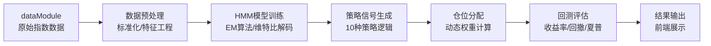

## Product Overview

基于Vue 3现有项目开发的HMM量化策略回测系统，使用纯JavaScript实现完整的策略研发、回测评估和可视化流程。

## Core Features

- **数据预处理模块**：对20个指数数据进行标准化、平滑处理和特征工程
- **HMM模型核心**：实现隐马尔可夫模型的训练、预测和状态识别
- **10种策略设计**：基于HMM状态信号开发多种交易策略
- **回测评估系统**：计算收益率、最大回撤、夏普比率等核心指标
- **仓位分配算法**：根据策略信号动态调整仓位权重
- **前端结果展示**：可视化展示策略表现和信号分布

## Tech Stack

- 开发语言：纯JavaScript (ES6+)
- 运行环境：Node.js (计算层) + Vue 3 (展示层)
- 数值计算：自定义数学工具库（无需第三方依赖）

## Tech Architecture

### 系统架构

- 架构模式：模块化分层架构（数据层-模型层-策略层-评估层）
- 核心入口：signalModule/index.js中的QiYouHeBaoDan函数
- 数据流向：dataModule → 预处理 → HMM训练 → 策略生成 → 回测评估 → 结果输出

### 模块划分

- **数据预处理模块**：负责数据清洗、标准化和特征提取
- **HMM模型模块**：实现EM算法训练和维特比解码
- **策略信号模块**：封装10种不同策略逻辑
- **回测评估模块**：计算回测指标和绩效分析
- **仓位管理模块**：实现仓位分配和风险控制

### 数据流



## Implementation Details

### 核心目录结构

```
jy/
├── signalModule/
│   ├── index.js                    # 核心入口，QiYouHeBaoDan函数
│   ├── hmmCore.js                  # HMM模型实现
│   ├── strategies.js               # 10种策略定义
│   ├── backtest.js                 # 回测评估逻辑
│   └── positionManager.js          # 仓位分配算法
├── dataModule/
│   └── index.js                    # 数据源接口
└── utils/
    └── mathUtils.js                # 数学工具函数
```

### 关键代码结构

**原始数据接口**

```javascript
// 从dataModule获取的数据结构
interface IndexData {
    id: string;
    plate: string;
    stock: string;
    fund: number;
    dateArr: string[];
    priceArr: number[];
    volumnArr: number[];
}
```

**HMM模型参数**

```javascript
interface HMMParams {
    numStates: number;      // 隐藏状态数量
    numObservations: number; // 观测状态数量
    initialProb: number[];  // 初始概率分布
    transitionProb: number[][]; // 状态转移矩阵
    emissionProb: number[][];   // 发射概率矩阵
}
```

**策略信号接口**

```javascript
interface StrategySignal {
    timestamp: string;
    state: number;          // HMM状态
    action: 'buy'|'sell'|'hold';
    confidence: number;     // 信号置信度
    position: number;       // 建议仓位
}
```

**回测结果接口**

```javascript
interface BacktestResult {
    totalReturn: number;    // 总收益率
    annualReturn: number;   // 年化收益率
    maxDrawdown: number;    // 最大回撤
    sharpeRatio: number;    // 夏普比率
    winRate: number;        // 胜率
    signalCount: number;    // 信号数量
    equityCurve: number[];  // 资金曲线
}
```

### 技术实现方案

1. **HMM模型实现**：使用纯JavaScript实现EM算法进行参数训练，维特比算法进行状态解码
2. **数据预处理**：实现Z-score标准化、移动平均平滑、技术指标计算
3. **策略封装**：每个策略作为独立函数，接收状态序列输出信号
4. **回测引擎**：向量化计算收益率和风险指标
5. **仓位管理**：基于Kelly公式或风险平价模型

### 集成点

- **数据输入**：从dataModule获取20个指数的完整时间序列数据
- **信号输出**：策略信号返回给前端进行可视化展示
- **配置参数**：HMM状态数、观测值、策略参数可配置化

## Agent Extensions

### SubAgent

- **code-explorer**
- Purpose: 探索现有项目结构，分析dataModule和signalModule的当前实现
- Expected outcome: 了解现有数据接口和代码结构，确保新功能与现有代码无缝集成